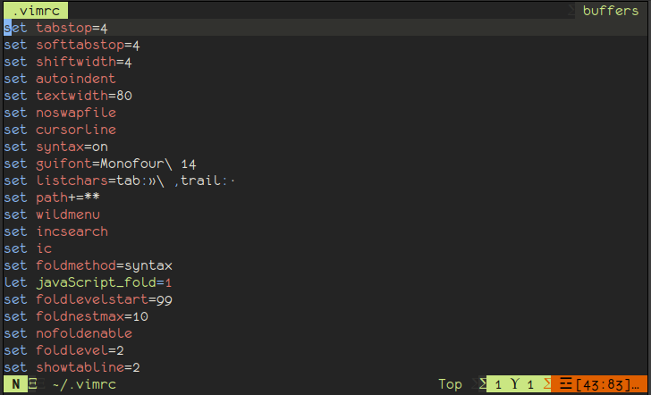

# Terminal VIM configuration

VIM set up for regular work. You can take this and apply it for yourself partially.

Aim of this file is do more with native VIM features and less with plugins. But the plugins are awesome.
I want to use VIM in more productive way then I use it now.
Stay tune and read my .vimrc later to get more tricks and tips around the 3W.

Features:
- show and hide tabs : <kbd>F3</kbd>
- toggle relative|absolute|none numbers : <kbd>Leader</kbd>+<kbd>r</kbd>

Use [ALE Engine|https://github.com/dense-analysis/ale] for linting and prettify code.
